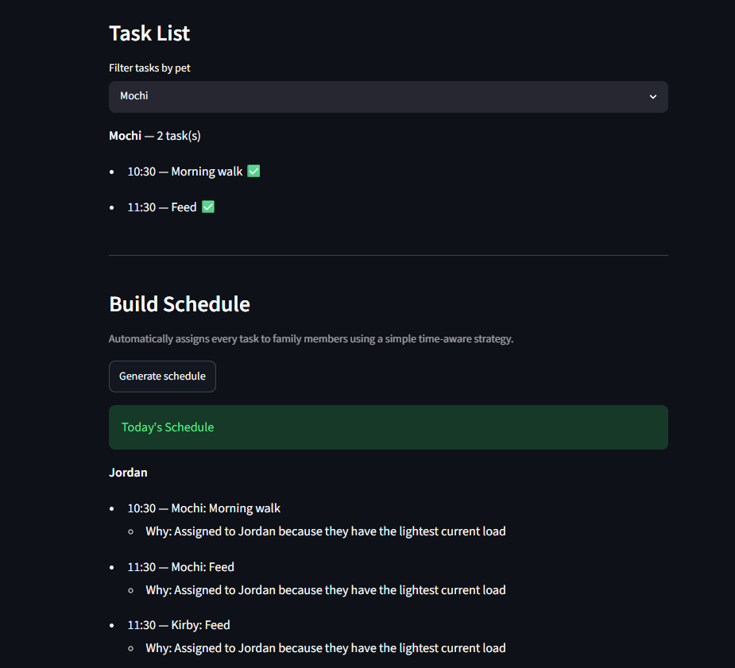

# PawPal+ (Module 2 Project)

You are building **PawPal+**, a Streamlit app that helps a pet owner plan care tasks for their pet.

## Scenario

A busy pet owner needs help staying consistent with pet care. They want an assistant that can:

- Track pet care tasks (walks, feeding, meds, enrichment, grooming, etc.)
- Consider constraints (time available, priority, owner preferences)
- Produce a daily plan and explain why it chose that plan

Your job is to design the system first (UML), then implement the logic in Python, then connect it to the Streamlit UI.

## What you will build

Your final app should:

- Let a user enter basic owner + pet info
- Let a user add/edit tasks (duration + priority at minimum)
- Generate a daily schedule/plan based on constraints and priorities
- Display the plan clearly (and ideally explain the reasoning)
- Include tests for the most important scheduling behaviors

## Getting started

### Setup

```bash
python -m venv .venv
source .venv/bin/activate  # Windows: .venv\Scripts\activate
pip install -r requirements.txt
```

### Suggested workflow

1. Read the scenario carefully and identify requirements and edge cases.
2. Draft a UML diagram (classes, attributes, methods, relationships).
3. Convert UML into Python class stubs (no logic yet).
4. Implement scheduling logic in small increments.
5. Add tests to verify key behaviors.
6. Connect your logic to the Streamlit UI in `app.py`.
7. Refine UML so it matches what you actually built.

## 🖥️ Sample Output

Paste a sample of your app's CLI or Streamlit output here so a reader can see what a generated plan looks like:

```
========================================
Today's Schedule for the Kirby family
========================================

Ferrin:
  - Rex: Feed (08:00)
  - Rex: Walk (17:30)
  - Milo: Feed (12:00)
  - Milo: Clean litter (20:00)
```

## 🧪 Testing PawPal+

```bash
# Run the full test suite:
pytest

# Run with coverage:
pytest --cov
```

Sample test output:

```
================================================== test session starts ==================================================
platform win32 -- Python 3.13.13, pytest-9.0.3, pluggy-1.6.0
rootdir: C:\Users\ferri\Code\AI110\ai110-module2show-pawpal-starter
plugins: anyio-4.13.0
collected 4 items                                                                                                        

tests\test_pawpal.py ....                                                                                          [100%]

=================================================== 4 passed in 0.03s ===================================================
```

## 📐 Smarter Scheduling

> Fill in once you've implemented scheduling logic.

| Feature | Method(s) | Notes |
|---------|-----------|-------|
| Task sorting | Sorts by time in day, so the schedule is in order| e.g., by priority, duration |
| Filtering | Can filter by pet name, viewing specific pet's tasks| e.g., skip tasks if time runs out |
| Conflict handling | Scheduler will warn the user of a conflict, and only schedule one task | e.g., overlapping time slots |
| Recurring tasks | | e.g., daily vs. weekly |
| Verify tasks | Can verify tasks were added to schedule | Add's a ✅ to the task list |

## 📸 Demo Walkthrough

Describe your app in numbered steps so a reader can follow along without watching a video:

1. Create a Pet by entering their name
2. Create a task for the pet, naming it and giving it a time
3. Repeat above with new pets and new tasks
4. Generate schedule
5. Verify tasks were taken care of, schedule was created

**Screenshot or video** *(optional)*: <!-- Insert a screenshot or link to a demo video here -->
