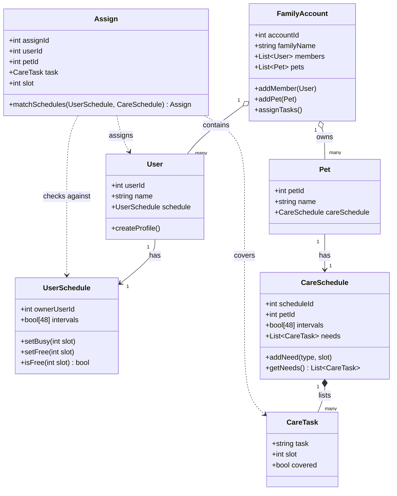

# PawPal+ UML Class Diagram

## Notes
- **FamilyAccount** is the top-level container grouping users and pets.
- **UserSchedule** and **CareSchedule** both use a 48-slot boolean array (30-min intervals over 24h).
- **Assign** holds the matching logic: it pairs a free user slot with a pet care need.
- **CareTask** is broken out so a CareSchedule can list multiple needs (feed, walk) at specific intervals.
